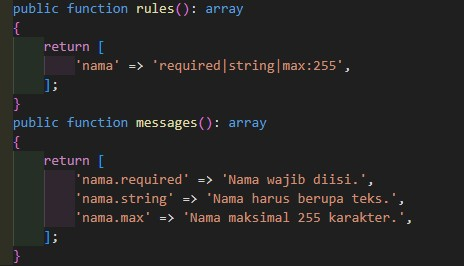
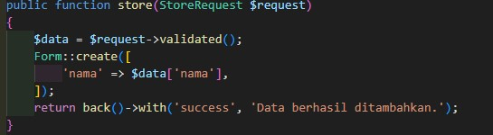
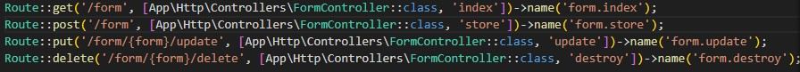

# Form Request — Laravel

Example Form Request adalah class khusus di Laravel untuk memisahkan validasi dan otorisasi dari controller. Dengan rules() data otomatis diverifikasi, dan dengan authorize() akses dapat dibatasi, sehingga controller lebih ringkas dan aman.

---

## 🖼 Screenshots

_Tambahkan screenshot aplikasi di sini untuk memperjelas tampilan fitur._

### Form Request



### Controller



### Route



---

## ✨ Fitur

-   Form Request

---

## 🧰 Teknologi

-   **Laravel** 10/11+ (PHP 8.1+)
-   **Bootstrap 5**

---

## 📦 Packages

-   Tidak Ada

---

## Example Membuat Form Request

```bash
php artisan make:request StoreRequest
```

---

## 🚀 Menjalankan

```bash
cp .env.example .env

composer install
php artisan key:generate
php artisan migrate
php artisan serve
```

Buka `http://localhost:8000`

---

## 🤝 Repo & Akses

**Repo (SSH):**
`https://github.com/winnicodeofficial/LARAVEL-EXAMPLE-FORM-REQUEST.git`

### Permintaan Akses

Repo bersifat privat. Silakan kirim email ke **[mikozua45@gmail.com](mailto:mikozua45@gmail.com)** dengan subjek **“Permintaan Akses Repo”** dan sertakan:

## 📄 Lisensi

Tentukan lisensi (MIT/Apache-2.0/Proprietary) sesuai kebutuhan. Jika tidak disebutkan, hak cipta tetap pada pemilik.
